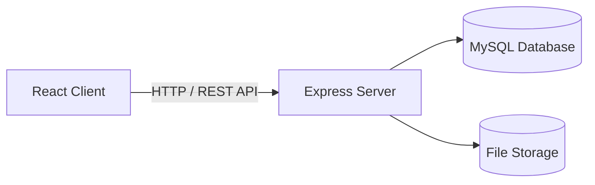
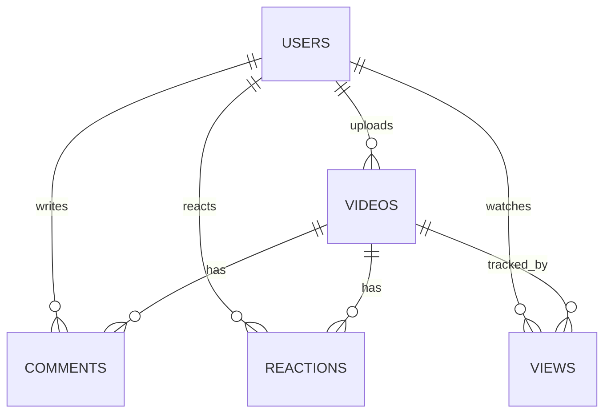

# My Streaming Site

## Description

My Streaming Site is a full-stack video streaming platform built with React and Node.js. It allows users to upload, watch, like, and comment on videos, browse categories, search content, and manage their profiles.

The application includes authentication, a responsive interface, and support for dark and light themes.

---

## Features

* User authentication (register, login)
* Video upload and streaming
* Video interaction (likes, dislikes, comments, views)
* Home page with video grid
* Category browsing
* Search functionality
* User profile management
* Theme toggle (dark/light)
* Responsive design

---

## Technologies Used

### Frontend

* React 19
* React Router DOM 7
* Vite 7
* ESLint 9

### Backend

* Node.js
* Express 5
* MySQL
* Multer (file uploads)
* bcrypt (password hashing)
* JWT (authentication)
* CORS

---

## Architecture



---

## Main User Flow

```
Register/Login
   ↓
Home Page (Video Grid)
   ↓
Select Video
   ↓
Video Page
   ├─ Watch
   ├─ Like / Dislike
   ├─ Comment
   └─ View tracked
   ↓
Profile Page
   ├─ Uploaded videos
   ├─ Liked videos
   └─ History
```

---

## Database Schema

### Tables Overview

* Users: application users
* Videos: uploaded videos
* Comments: user comments
* Reactions: likes/dislikes
* Views: video view tracking

---

# Campi delle Tabelle

## USERS
| Campo        | Tipo     | Vincoli        |
|-------------|----------|---------------|
| id          | INT      | PK            |
| username    | STRING   |               |
| email       | STRING   |               |
| password    | STRING   |               |
| created_at  | DATETIME |               |

---

## VIDEOS
| Campo        | Tipo     | Vincoli              |
|-------------|----------|---------------------|
| id          | INT      | PK                  |
| title       | STRING   |                     |
| description | STRING   |                     |
| filepath    | STRING   |                     |
| upload_date | DATETIME |                     |
| user_id     | INT      | FK → USERS.id       |
| category    | STRING   |                     |

---

## COMMENTS
| Campo       | Tipo     | Vincoli              |
|------------|----------|---------------------|
| id         | INT      | PK                  |
| video_id   | INT      | FK → VIDEOS.id      |
| user_id    | INT      | FK → USERS.id       |
| comment    | STRING   |                     |
| created_at | DATETIME |                     |

---

## REACTIONS
| Campo     | Tipo   | Vincoli              |
|----------|--------|---------------------|
| id       | INT    | PK                  |
| video_id | INT    | FK → VIDEOS.id      |
| user_id  | INT    | FK → USERS.id       |
| type     | STRING |                     |

---

## VIEWS
| Campo      | Tipo     | Vincoli              |
|-----------|----------|---------------------|
| id        | INT      | PK                  |
| video_id  | INT      | FK → VIDEOS.id      |
| user_id   | INT      | opzionale           |
| view_date | DATETIME |                     |

---
## ER Diagram



### Notes

* A user can upload multiple videos
* Each video can have multiple comments and reactions
* Views can be associated with users or tracked anonymously
* Reactions support both like and dislike

---

## Installation

```bash
git clone <repo-url>
cd MYSTREAMINGSITE
```

### Backend setup

```bash
cd server
npm install
```

### Frontend setup

```bash
cd client
npm install
```

---

## Configuration

### Database

* Create a MySQL database
* Update server/config/dbConfig.js with your credentials

### Environment variables

Create a .env file inside server/:

```env
DB_HOST=localhost
DB_USER=youruser
DB_PASS=yourpass
DB_NAME=mystreaming
JWT_SECRET=your_secret
PORT=5000
```

### Uploads

Ensure the server/uploads/ directory exists and is writable.

---

## Running the Project

### Start backend

```bash
cd server
npm run dev
```

### Start frontend

```bash
cd client
npm run dev
```

Open [http://localhost:5173](http://localhost:5173) in your browser.

---

## API Endpoints

Base URL: [http://localhost:5000/api](http://localhost:5000/api)

### Auth

* POST /users/register
* POST /users/login

### Videos

* GET /videos
* GET /videos/:id
* POST /videos/upload
* GET /videos/category/:category

### Profile

* GET /profile
* PUT /profile

### Comments

* POST /comments
* GET /comments/:videoId

### Reactions

* POST /reactions
* GET /reactions/:videoId

---

## Folder Structure

```
MYSTREAMINGSITE/
├── client/
│   ├── src/
│   │   ├── components/
│   │   ├── pages/
│   │   ├── services/
│   │   └── routes.jsx
│
├── server/
│   ├── controllers/
│   ├── routes/
│   ├── middleware/
│   ├── config/
│   ├── uploads/
│   └── app.js
```

---
## Testing example
curl -X POST http://localhost:5000/api/users/register |
-H "Content-Type: application/json" |
-d '{"username":"tedi","email":"tedi","password":"tedi"}'

## Possible Improvements

* Video thumbnail generation
* Pagination for videos and comments
* Streaming optimization (HLS)
* Real-time comments (WebSockets)
* User subscriptions
* Admin dashboard
* Automated testing
* Docker support
* Deployment setup

---

## Author

Tedi Vogli
